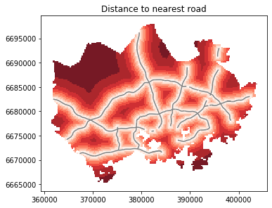
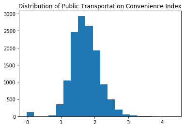

#Geospatial analytics in Python
##Purpose of file
This is a Jupyter notebook of geographical analytics in Python using geopandas shapely and bokeh. 
###First part
The first part of this file creates a static map showing the nearest distance from anywhere in downtown Stockholm. In addition, it calculates the average public transportation commuting time in the city to the Railway station.
###Second part
The second part creates a interactive map showing the convenience of public transportation to Railway Station across the city. Please see the final interactive map product [here](https://zibowangkangyu.github.io/pythonDS/accessibility_map_Helsinki). 

Thanks to *Intro to Python GIS* course offered [here](https://automating-gis-processes.github.io/CSC18/index.html) by CSC Finland, IT Center for Science. 


```python
#cd "C:/Users/kangyuwang/OneDrive/portfolio/python_geo/Exercise 5"
```


```python
##Import packages
from bokeh.palettes import YlOrRd6 as palette
from bokeh.plotting import figure, save, show
from bokeh.models import ColumnDataSource, HoverTool, LogColorMapper, GeoJSONDataSource
from bokeh.palettes import RdYlGn10 as palette
from matplotlib import pyplot as plt
import geopandas as gpd
import pysal as ps
import numpy as np
import pandas as pd
import mapclassify
from shapely.geometry import Point, LineString, Polygon
from shapely.ops import nearest_points
```

    C:\ProgramData\Anaconda3\lib\site-packages\pysal\model\spvcm\abstracts.py:10: UserWarning: The `dill` module is required to use the sqlite backend fully.
      from .sqlite import head_to_sql, start_sql
    


```python
##Read data
data=gpd.read_file("dataE5/TravelTimes_to_5975375_RailwayStation.shp")
roads=gpd.read_file("dataE5/roads.shp")
metro=gpd.read_file("dataE5/metro.shp")
pop=gpd.read_file("dataE5/Vaestotietoruudukko_2015.shp")
###CRS of four datasets are set to be identical
data=data.to_crs(epsg=3067)
roads=roads.to_crs(epsg=3067)
metro=metro.to_crs(epsg=3067)
pop=pop.to_crs(epsg=3067)
```


```python
##Exploring data: travel 
data.head()
data.loc[:, "centroid"]=data.loc[:, "geometry"].apply(lambda f: f.centroid)
```


```python
##Exploring data: roads and metro
roads.head()
metro.head()
```


<div>
<style scoped>
    .dataframe tbody tr th:only-of-type {
        vertical-align: middle;
    }

    .dataframe tbody tr th {
        vertical-align: top;
    }

    .dataframe thead th {
        text-align: right;
    }
</style>
<table border="1" class="dataframe">
  <thead>
    <tr style="text-align: right;">
      <th></th>
      <th>NUMERO</th>
      <th>SUUNTA</th>
      <th>geometry</th>
    </tr>
  </thead>
  <tbody>
    <tr>
      <td>0</td>
      <td>1300M</td>
      <td>1</td>
      <td>LINESTRING (395360.222060516 6679514.826319194...</td>
    </tr>
    <tr>
      <td>1</td>
      <td>1300M</td>
      <td>2</td>
      <td>LINESTRING (384223.529403562 6671360.762176151...</td>
    </tr>
    <tr>
      <td>2</td>
      <td>1300M1</td>
      <td>1</td>
      <td>LINESTRING (395360.222060516 6679514.826319194...</td>
    </tr>
    <tr>
      <td>3</td>
      <td>1300M1</td>
      <td>2</td>
      <td>LINESTRING (393483.9532311981 6676347.80259114...</td>
    </tr>
    <tr>
      <td>4</td>
      <td>1300M2</td>
      <td>1</td>
      <td>LINESTRING (393483.9532311981 6676347.80259114...</td>
    </tr>
  </tbody>
</table>
</div>


```python
##Generating distance to nearest road and metro
###Combine the roads into single polyline
roads.loc[:, "for_dissolve"]=1
roads_uni = roads.dissolve(by="for_dissolve")
roads_uni=roads_uni.loc[:, "geometry"]
###Combine the metro into single polyline
metro.loc[:, "for_dissolve"]=1
metro_uni = metro.dissolve(by="for_dissolve")
metro_uni=metro_uni.loc[:, "geometry"]

##Calculating the distance of all polygons in the "data" geodataframe to the neaest road and metro
data.loc[:, "distance_roads"]=[nearest_points(data.loc[i, "geometry"], roads_uni.iloc[0])[0].distance(nearest_points(data.loc[i, "geometry"], roads_uni.iloc[0])[1]) for i in range(len(data.index))]
data.loc[:, "distance_metro"]=[nearest_points(data.loc[i, "geometry"], metro_uni.iloc[0])[0].distance(nearest_points(data.loc[i, "geometry"], metro_uni.iloc[0])[1]) for i in range(len(data.index))]
```


```python
##Genearting static map
static_map=data.plot(column="distance_roads", linewidth=0.03, cmap="Reds", scheme="quantiles", k=9, alpha=0.9)
roads.plot(ax=static_map, color="grey", linewidth=1.5)
plt.tight_layout()
plt.title("Distance to nearest road")
plt.savefig("static_map.png", dpi=300)
```





```python
##Average public transportation commuting time of residents
pop.loc[:, "centroid"]=pop.loc[:, "geometry"].apply(lambda f: f.centroid)
###The average public transportation comumuting time of each cell in the pop geodataframe is identified as the transportation comumuting time of its centroid 
pop_cen=pop.loc[:, ["ASUKKAITA", "centroid"]]
data_cen=data.loc[:, ["pt_r_tt", "geometry"]]
pop_cen.columns=["ASUKKAITA", "geometry"]
pop_cen_join=gpd.sjoin(pop_cen, data_cen, how="left", op="intersects")
```


```python
indices = ~np.isnan(pop_cen_join.loc[:, "pt_r_tt"])
pt_avrg=np.average(pop_cen_join.loc[indices, "pt_r_tt"], weights=pop_cen_join.loc[indices, "ASUKKAITA"])
f"The average public transportation commute time is {pt_avrg:.2f} minutes"
```


    'The average public transportation commute time is 37.89 minutes'


```python
#Interactive map
##Add coordinates in x and y columns so that they can be converted to ColumnDataSource
roads.loc[39, "geometry"]=roads.loc[39, "geometry"][0]
roads.loc[158, "geometry"]=roads.loc[158, "geometry"][0]
data.loc[:, "x"]=data.loc[:, "geometry"].apply(lambda f: list(f.exterior.xy[0]))
data.loc[:, "y"]=data.loc[:, "geometry"].apply(lambda f: list(f.exterior.xy[1]))
metro.loc[:, "x"]=metro.loc[:, "geometry"].apply(lambda f: list(f.xy[0]))
metro.loc[:, "y"]=metro.loc[:, "geometry"].apply(lambda f: list(f.xy[1]))
roads.loc[:, "x"]=roads.loc[:, "geometry"].apply(lambda f: list(f.xy[0]))
roads.loc[:, "y"]=roads.loc[:, "geometry"].apply(lambda f: list(f.xy[1]))
```


```python
##Create new variable to meaasure the convenience of public transportation
data.loc[:, "pt_con"]=data.loc[:, "pt_r_tt"]/data.loc[:, "car_r_t"]
indices = ~np.isnan(data.loc[:, "pt_con"])
data_map=data.loc[indices].copy()
plt.hist(data_map.loc[:, "pt_con"], bins=20)
plt.title("Distribution of Public Transportation Convenience Index")
```


    Text(0.5, 1.0, 'Distribution of Public Transportation Convenience Index')





```python
##Classify the pt_con variable: using the Fisher Jenks method
classifier=mapclassify.Fisher_Jenks(data_map.loc[:, "pt_con"], k=6)
data_map.loc[: ,"pt_con_clsf"]=classifier(data_map.loc[:, "pt_con"])
d1={0: "0-0.562", 1: "0.562-1.361", 2: "1.361-1.675", 3: "1.675-1.980", 4: "1.980-2.375", 5: "2.375-4.357"}
data_map.loc[:, "pt_con_name"] = data_map.loc[: ,"pt_con_clsf"].apply(lambda x: d1.get(x))
```


```python
##Making maps
df=data_map.loc[:, ['x', 'y', 'pt_r_tt', 'car_r_t', 'from_id', 'pt_con', 'pt_con_name']]
df_source=ColumnDataSource(data=df)

rdf=roads.loc[:, ["x", "y"]]
rdf_source=ColumnDataSource(data=rdf)

mdf=metro.loc[:, ["x", "y"]]
mdf_source=ColumnDataSource(data=mdf)

TOOLS="pan, wheel_zoom, box_zoom, reset, save"

palette.reverse()
color_mapper=LogColorMapper(palette=palette)

p=figure(title="Convenience of Public Transportation to Helsinki City Center", tools=TOOLS, plot_width=650, plot_height=500, active_scroll="wheel_zoom")
p.grid.grid_line_color=None
grid=p.patches("x", "y", source=df_source, name="grid", fill_color={"field":"pt_con", "transform":color_mapper}, fill_alpha=1.0, line_color="black", line_width=0.03, legend="pt_con_name")
r=p.multi_line("x", "y", source=rdf_source, color="grey")
m=p.multi_line("x", "y", source=mdf_source, color="red")

p.legend.location="top_right"
p.legend.orientation="vertical"

circle=p.circle(x=385752.214, y=6672143.803, name="point", size=6, color="yellow")

phover=HoverTool(renderers=[circle])
phover.tooltips=[("Destination", "Railway Station")]

ghover=HoverTool(renderers=[grid])
ghover.tooltips=[("YKR-ID", "@from_id"), ("PT time", "@pt_r_tt"), ("Car time", "@car_r_t"), ("Convenience index", "@pt_con")]

p.add_tools(ghover)
p.add_tools(phover)

show(p)
save(p, "accessibility_map_Helsinki.html")
```

    C:\ProgramData\Anaconda3\lib\site-packages\bokeh\io\saving.py:126: UserWarning: save() called but no resources were supplied and output_file(...) was never called, defaulting to resources.CDN
      warn("save() called but no resources were supplied and output_file(...) was never called, defaulting to resources.CDN")
    C:\ProgramData\Anaconda3\lib\site-packages\bokeh\io\saving.py:139: UserWarning: save() called but no title was supplied and output_file(...) was never called, using default title 'Bokeh Plot'
      warn("save() called but no title was supplied and output_file(...) was never called, using default title 'Bokeh Plot'")
    


    'C:\\Users\\kangyuwang\\OneDrive\\portfolio\\pythonDS\\Exercise 5\\accessibility_map_Helsinki.html'


